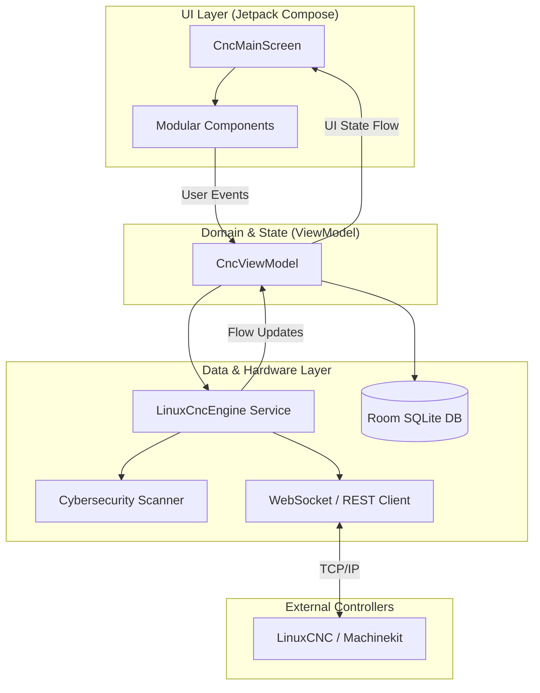
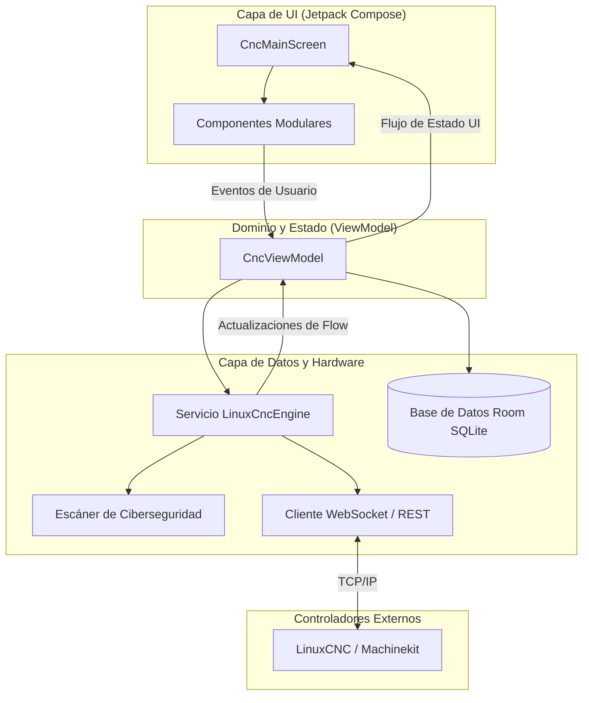

# LinuxCncDroid 🎛️

[](https://android.com)
[](https://kotlinlang.org)
[](https://developer.android.com/jetpack/compose)
[](https://linuxcnc.org)
[](PRIVACY_POLICY.md)

[English Version](#-english-version) | [Versión en Español](#-versión-en-español)

---

## 🇺🇸 English Version

**LinuxCncDroid** is a high-fidelity, touch-optimized industrial Human-Machine Interface (HMI) built for monitoring, controlling, optical centering, and metrology calibration of CNC machine tools powered by **LinuxCNC** and **Machinekit**.

Crafted natively in **Kotlin** using **Jetpack Compose** and **Material 3 Industrial Design**, LinuxCncDroid provides out-of-the-box support for industry-standard fieldbus topologies (Mesa FPGA, EtherCAT, and Parallel Port), featuring real-time telemetry, a haptic Virtual MPG Handwheel, an interactive 3D G-Code Toolpath visualizer, 3D probing routines, live camera crosshairs, reactive Metric ($G21$ mm) / Imperial ($G20$ inch) switching, and an ISO 230-2 metrology calibration wizard.

---

### 🚀 Key Features

#### 1. Digital Readout (DRO) & Machine Controls
* **Multi-Axis Readout**: Real-time display for linear axes ($X, Y, Z$) and rotary axes ($A, B, C$).
* **Work Coordinate Systems (WCS)**: Instant switching and axis zeroing for $G54, G55, G56, G57, G58, G59, G59.1, G59.2, G59.3$.
* **Dual Unit System ($G21$ / $G20$)**: 100% reactive switching between Metric ($\text{mm}$, $\text{mm/min}$) and Imperial ($\text{in}$, $\text{IPM}$) with precision decimals adapted across all panels.
* **Spindle & Feed Management**:
  * RPM dial controls, encoder feedback display, and CW/CCW direction toggle.
  * Feedrate Override ($0\% - 200\%$) and Spindle Speed Override ($50\% - 150\%$).
  * Flood coolant (M8), Mist coolant (M7), and Air blast controls.
* **Safety & Hardware E-STOP**:
  * High-priority Emergency Stop button with instant machine de-energization and structured power-on safety sequence.

#### 2. Virtual Electronic MPG Handwheel & Jogging
* **Multiplier Selector**: Step increments $\times1$ ($0.001\text{ mm}$ / $0.0001\text{ in}$), $\times10$ ($0.010\text{ mm}$ / $0.001\text{ in}$), $\times100$ ($0.100\text{ mm}$ / $0.010\text{ in}$), and $\times1000$ ($1.000\text{ mm}$ / $0.100\text{ in}$).
* **Virtual Rotary Dial**: Drag-based smooth handwheel with synchronized haptic clicks on every step resolution.
* **Continuous & Incremental Jog**: On-screen directional pads with dynamic velocity sliders.

#### 3. Interactive 3D G-Code Toolpath Visualizer
* **Isometric 3D Engine**: Interactive 3D render with multitouch pinch-to-zoom, orbital rotation, and panning.
* **Trajectory Color Coding**:
  * Rapid traverse moves ($G0$) in dashed warning lines.
  * Linear cutting feeds ($G1$) and circular arcs ($G2/G3$) highlighted with distinct color codings.
* **Real-Time Tool Tracking**:
  * Dynamic tool tip marker synchronized with the DRO.
  * Progress percentage, estimated remaining cycle time, and bounding box dimensions ($X, Y, Z$).

#### 4. Optical Centering & Machine Vision (CNC CAM)
* **CameraX Vision Assistant**:
  * Micrometric Crosshair reticle ($0.01\text{ mm}$ ticks).
  * Concentric Circles reticle for bore and round stock centering.
  * Metrology Grid for vise alignment and tramming.
  * $90^\circ$ Optical Edge Finder for stock corner pickup.
* **Overlay HUD Telemetry**: Real-time DRO coordinates projected onto the camera feed.
* **Micro-Jogging Controls**: Single-tap micro adjustments ($\pm 0.05\text{ mm}$ / $\pm 0.002\text{ in}$) and direct "ZERO X" / "ZERO Y" buttons.

#### 5. ISO 230-2 Metrology Axis Calibration Wizard
* **Segmented Metrology Procedure**:
  * 10-interval measurement points along axis travel (11 calibration steps).
  * Presets for calibration standards: Dial Gauge ($\pm 0.003\text{ mm}$), Glass Linear Scale ($\pm 0.001\text{ mm}$), Micrometer ($\pm 0.002\text{ mm}$), Laser Interferometer ($\pm 0.0005\text{ mm}$).
* **Statistical Uncertainty**:
  * Calculation of mean bias, max error, and expanded uncertainty ($k=2$, $95.45\%$ confidence).
* **LinuxCNC HAL Export (`comp.tbl`)**:
  * Generates pitch error compensation tables ready for LinuxCNC's `linear_comp` HAL component with one-tap clipboard copy.

#### 6. 3D Probing & Tool Management
* **Automated Probing Routines**:
  * Corner pickup (exterior and interior $X/Y$).
  * Automatic 4-point cylinder bore centering.
  * Tool length setter and Z workpiece zero touch-off with 1-2-3 standard gauge blocks.
* **Tool Table & ATC**:
  * Local SQLite persistence via Room Database for tool diameter, length offset ($G43\ H$), tool type, and wear offsets.

#### 7. Fieldbus & Hardware Diagnostics
* **Hardware Architectures**:
  * **Mesa Electronics FPGA** (5i25, 6i24, 7i76E, 7i92, 7i96) via Hostmot2.
  * **EtherCAT Master** (CiA 402 Servo Drives, Beckhoff, Omron, Delta).
  * **Parallel Port (LPT)** software step generation.
* **Telemetry Monitor**:
  * Real-time 1 kHz servo-thread frequency counter, microsecond jitter gauge, packet monitor, and CiA 402 drive state machine view.

---

### 🏛️ Technical Architecture

LinuxCncDroid follows the modern **Clean Architecture** patterns using the **MVVM (Model-View-ViewModel)** design pattern and **Unidirectional Data Flow (UDF)**.



#### Key Components:
- **`LinuxCncEngine`**: The core service managing the real-time kinematics loop, telemetry aggregation, and communication protocols.
- **`CncViewModel`**: Preserves industrial state using `SavedStateHandle` and orchestrates data flow between the engine and the UI.
- **`CncSecurityScanner`**: A specialized module that inspects incoming G-Code for malicious payloads or dangerous kinematic commands before execution.
- **`NetworkConnectivityObserver`**: A reactive monitor that detects changes in the device's network state to ensure reliable machine-tool connectivity.

---

### 🗺️ 2024-2025 Feature Roadmap

- [ ] **Phase 1: Advanced Metrology** (Q3 2024)
  - Integration of ISO 230-2 bidirectional compensation.
  - Thermal expansion drift sensors monitoring.
- [ ] **Phase 2: Intelligent G-Code Assistant** (Q4 2024)
  - LLM-powered G-Code optimization and error correction.
  - Predictive tool wear analysis based on cutting hours.
- [ ] **Phase 3: Multi-Machine Orchestration** (Q1 2025)
  - Simultaneous monitoring of multiple machine profiles in a shop-floor view.
  - Unified alert dashboard for EtherCAT bus failures across multiple CNCs.

---

### 🔌 Connecting to LinuxCNC

1. Ensure the remote interface (such as `linuxcncrsh` or a dedicated TCP socket server) is enabled in your LinuxCNC environment.
2. In LinuxCncDroid, navigate to the **CONFIG** tab.
3. Enter your LinuxCNC controller's IP address (e.g., `192.168.1.120`) and target port (default `5007`).
4. Select your hardware architecture (**Mesa FPGA**, **EtherCAT**, or **Parallel Port**) and tap **CONNECT CONTROLLER**.

---

### 🛡️ Privacy Policy & Security
LinuxCncDroid is designed for local machine-tool networks. It does not collect or transmit personal telemetry or user data to external cloud servers. For full details, see [PRIVACY_POLICY.md](PRIVACY_POLICY.md).

---
---

## 🇪🇸 Versión en Español

**LinuxCncDroid** es una interfaz hombre-máquina (HMI) industrial moderna, táctil y de alta fidelidad diseñada para el control, supervisión, centrado óptico y calibración metrológica de máquinas CNC que operan bajo **LinuxCNC** y **Machinekit**.

Construida íntegramente en **Kotlin** con **Jetpack Compose** y arquitectura **Material 3**, LinuxCncDroid ofrece soporte nativo para las principales topologías de hardware industrial (Mesa FPGA, EtherCAT y Puerto Paralelo), integrando telemetría en tiempo real, volante electrónico con respuesta háptica (MPG), visualizador 3D de trayectorias G-code, palpado 3D, visión por cámara, cambio reactivo Métrico ($G21$ mm) / Imperial ($G20$ pulg) y asistente de calibración metrológica según norma **ISO 230-2**.

---

### 🚀 Características Principales

#### 1. Panel de Control y Lectura Digital (DRO)
* **Visualización de Ejes Múltiples**: Lectura en tiempo real para ejes lineales $X, Y, Z$ y rotativos $A, B, C$.
* **Sistemas de Coordenadas de Trabajo (WCS)**: Cambio inmediato y puesta a cero para $G54, G55, G56, G57, G58, G59, G59.1, G59.2, G59.3$.
* **Sistema de Unidades Dual ($G21$ / $G20$)**: Conmutación 100% reactiva entre Sistema Métrico ($\text{mm}$, $\text{mm/min}$) e Imperial ($\text{in}$, $\text{IPM}$) con ajuste automático de precisión decimal en todos los paneles.
* **Control de Husillo y Avances**:
  * Ajuste de RPM nominales y lecturas de encoder en tiempo real.
  * Modulación de Feed Override ($0\% - 200\%$) y Spindle Override ($50\% - 150\%$).
  * Control de refrigerante por niebla (M7), chorro (M8) y soplado de aire.
* **Seguridad y Parada de Emergencia (E-STOP)**:
  * Botón físico/virtual prioritario de Parada de Emergencia con desenergización segura y rearme secuencial.

#### 2. Volante Electrónico (MPG Jogging) con Feedback Háptico
* **Selector de Multiplicador**: Pasos discretos $\times1$ ($0.001\text{ mm}$ / $0.0001\text{ in}$), $\times10$ ($0.010\text{ mm}$ / $0.001\text{ in}$), $\times100$ ($0.100\text{ mm}$ / $0.010\text{ in}$) y $\times1000$ ($1.000\text{ mm}$ / $0.100\text{ in}$).
* **Rueda Táctil Virtual**: Diales giratorios con detención táctil háptica (vibración física) sincronizada a cada incremento angular.
* **Jogging Continuo y por Pasos**: Desplazamiento fino y rápido para aproximación de herramienta.

#### 3. Visualizador 3D de Trayectorias G-Code (Toolpath)
* **Motor de Renderizado 3D Isométrico**: Proyección tridimensional interactiva con soporte de rotación orbital, paneo y zoom multitáctil.
* **Diferenciación de Movimientos**:
  * Movimientos rápidos ($G0$) en línea discontinua de advertencia.
  * Avances de corte lineal ($G1$) y arcos circulares ($G2/G3$) con distinción cromática.
* **Ejecución y Simulación en Vivo**:
  * Marcador de posición de herramienta en tiempo real sincronizado con el DRO.
  * Línea de progreso de ejecución, tiempo estimado y verificación de cotas límite ($X, Y, Z$).

#### 4. Sistema de Visión y Centrado Óptico (CNC CAM)
* **Cámara Industrial con CameraX**:
  * Retícula Cruciforme de precisión con divisiones micrométricas ($0.01\text{ mm}$).
  * Retícula de Círculos Concéntricos para centrado de orificios y piezas cilíndricas.
  * Cuadrícula Metrológica para alineación y paralelismo de mordazas.
  * Buscador de esquina a $90^\circ$ (Edge Finder) para alineación de cantos de material.
* **Telemetría DRO Superpuesta (HUD)**: Lectura de coordenadas activas en pantalla mientras se ajusta la alineación.
* **Micro-Jogging Integrado**: Pasos finos ($\pm 0.05\text{ mm}$ / $\pm 0.002\text{ in}$) y botones directos de "CERO X" y "CERO Y" desde la vista de cámara.
* **Captura de Instantáneas**: Registro fotográfico de inspección y control de calidad.

#### 5. Asistente de Calibración Metrológica de Ejes (ISO 230-2)
* **Procedimiento Metrológico por Sectores**:
  * División configurable de la carrera del eje al 10% (11 puntos de calibración).
  * Presets para instrumentos patrón: Reloj comparador ($\pm 0.003\text{ mm}$), Regla de cristal ($\pm 0.001\text{ mm}$), Micrómetro ($\pm 0.002\text{ mm}$), Interferómetro láser ($\pm 0.0005\text{ mm}$).
* **Cálculo Estadístico de Incertidumbre**:
  * Cálculo de sesgo medio, error máximo e incertidumbre expandida ($k=2$, $95.45\%$ nivel de confianza).
* **Exportación HAL LinuxCNC (`comp.tbl`)**:
  * Generación automática de la tabla de compensación de paso para el módulo `linear_comp` del HAL de LinuxCNC con copiado directo al portapapeles.

#### 6. Palpador 3D y Rutinas de Centrado (Probing)
* **Rutinas Automatizadas**:
  * Palpado de esquina exterior e interior ($X/Y$).
  * Centrado automático de orificios cilíndricos (método de 4 puntos).
  * Toma de cota $Z$ cero de pieza con bloque patrón.
* **Tabla de Herramientas y ATC**:
  * Gestión local con persistencia en **Room Database** de offsets de longitud ($G43\ H$), radio y tipo de fresa.

#### 7. Diagnóstico de Bus de Campo y Red
* **Soporte de Topologías de Hardware**:
  * **Mesa Electronics FPGA** (5i25, 6i24, 7i76E, 7i92, 7i96) vía Hostmot2.
  * **EtherCAT Master** (CiA 402 Servo Drives, Beckhoff, Omron, Delta).
  * **Puerto Paralelo (LPT)** con generador de pasos por software.
* **Monitor de Telemetría**:
  * Frecuencia de servo-hilo (1000 Hz / 1 kHz), jitter en microsegundos, paquetes transmitidos y monitor de estados CiA 402.

---

### 🏛️ Arquitectura Técnica

LinuxCncDroid sigue patrones modernos de **Clean Architecture** utilizando el patrón de diseño **MVVM (Model-View-ViewModel)** y **Flujo de Datos Unidireccional (UDF)**.



#### Componentes Clave:
- **`LinuxCncEngine`**: El servicio principal que gestiona el bucle de cinemática en tiempo real, la agregación de telemetría y los protocolos de comunicación.
- **`CncViewModel`**: Preserva el estado industrial utilizando `SavedStateHandle` y orquesta el flujo de datos entre el motor y la interfaz de usuario.
- **`CncSecurityScanner`**: Un módulo especializado que inspecciona el G-Code entrante en busca de cargas maliciosas o comandos cinemáticos peligrosos antes de su ejecución.
- **`NetworkConnectivityObserver`**: Un monitor reactivo que detecta cambios en el estado de red del dispositivo para asegurar una conectividad fiable con la máquina-herramienta.

---

### 🗺️ Hoja de Ruta (Roadmap) 2024-2025

- [ ] **Fase 1: Metrología Avanzada** (T3 2024)
  - Integración de compensación bidireccional según ISO 230-2.
  - Monitoreo de sensores de deriva por expansión térmica.
- [ ] **Fase 2: Asistente de G-Code Inteligente** (T4 2024)
  - Optimización y corrección de errores de G-Code mediante modelos de lenguaje (LLM).
  - Análisis predictivo de desgaste de herramientas basado en horas de corte.
- [ ] **Fase 3: Orquestación Multi-Máquina** (T1 2025)
  - Supervisión simultánea de múltiples perfiles de máquina en una vista de planta.
  - Panel de alertas unificado para fallos en buses EtherCAT en múltiples CNCs.

---

### 🛠️ Arquitectura y Tecnologías

* **Lenguaje**: Kotlin 100%
* **Interfaz de Usuario**: Jetpack Compose con Material Design 3 (M3 Industrial Dark Theme)
* **Cámara & Visión**: Android CameraX (Core, Camera2, Lifecycle, View)
* **Persistencia Local**: Android Jetpack Room Database con SQLite para perfiles de máquina y tabla de herramientas
* **Concurrencia y Reactividad**: Kotlin Coroutines & StateFlow (`collectAsStateWithLifecycle`)
* **Gestión de Ciclo de Vida**: Architecture Components ViewModel & LiveData
* **Comunicación LinuxCNC**: Clientes TCP para protocolo NML / `linuxcncrsh` y emulador en tiempo real integrado

---

### 📂 Estructura del Proyecto

```
LinuxCncDroid/
├── app/
│   ├── src/main/
│   │   ├── java/com/example/
│   │   │   ├── data/            # Entidades Room, DAOs y Base de Datos local
│   │   │   ├── model/           # Modelos de dominio (Ejes, Estados, GCode, Metrología)
│   │   │   ├── service/         # Motor de comunicación LinuxCNC y generador de eventos
│   │   │   ├── ui/
│   │   │   │   ├── components/  # Componentes modulares (DRO, MPG, Cámara, 3D, Calibración)
│   │   │   │   ├── screens/     # Pantalla principal y pestañas de navegación
│   │   │   │   └── theme/       # Paleta de colores industriales, Tipografía y Formas M3
│   │   │   ├── viewmodel/       # CncViewModel y gestión de estados
│   │   │   └── MainActivity.kt  # Punto de entrada de la aplicación
│   │   ├── res/                 # Recursos XML (strings, drawables, icono adaptativo)
│   │   └── AndroidManifest.xml
│   └── build.gradle.kts
├── gradle/libs.versions.toml    # Catálogo de versiones centralizado
├── metadata.json
├── settings.gradle.kts
├── PRIVACY_POLICY.md            # Política de Privacidad Bilingüe
└── README.md                    # Documentación Técnica Bilingüe
```

---

### 🔌 Conexión con LinuxCNC

1. Asegúrese de que el servidor LinuxCNC tenga habilitado el servidor de control remoto (por ejemplo, `linuxcncrsh` o socket TCP HAL).
2. En LinuxCncDroid, vaya a la pestaña **CONFIG**.
3. Ingrese la dirección IP del controlador LinuxCNC (por ejemplo `192.168.1.120`) y el puerto configurado (por defecto `5007`).
4. Seleccione la arquitectura correspondiente (**Mesa FPGA**, **EtherCAT** o **LPT**) y presione **CONECTAR CONTROLADOR**.

---

### 🛡️ Política de Privacidad
Para consultar la política de privacidad y tratamiento de datos de LinuxCncDroid, acceda a [PRIVACY_POLICY.md](PRIVACY_POLICY.md).

---

### 📄 Licencia
Este proyecto está disponible para la comunidad industrial y fabricantes CNC bajo licencia de código abierto.
